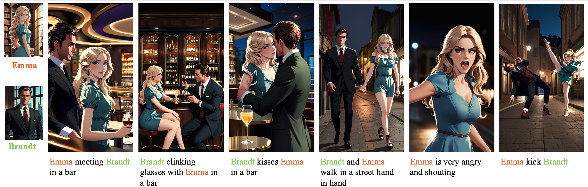

<div align="center">
<h1>RaCig: A RAG-based Character-Consistent Story Image Generation Model</h1>

<a href='https://huggingface.co/ZuluVision/RaCig'></a>
<a href='https://pan.baidu.com/s/1Vt2meAg5DkjUXktY_H6eNg?pwd=ympj'></a>
</div>

### 1. Multi-charater image generation with rich motion
<div align="center">

</div>

### 2. Model structure preview
<div align="center">

</div>


## 📖 Overview

RaCig is designed to generate images based on textual prompts and reference images for characters (referred to as "Characters"). It leverages several models and techniques, including:

*   Text-to-image retrieval (using CLIP)
*   IP-Adapter for incorporating reference image features (face and body/clothes)
*   ControlNet for pose/skeleton guidance
*   Action Direction DINO for action direction recognition
*   A pipeline (`RaCigPipeline`) to orchestrate the generation process.

The pipeline can handle multiple characters ("Characters") in a single scene, defined by their names, gender, and reference images (face and clothes).

## 📦 Installation

1.  **Clone the repository:**
    ```bash
    git clone https://github.com/ZulutionAI/RaCig
    cd RaCig
    ```

2.  **Install dependencies:**
    ```bash
    pip install -r requirements.txt
    ```

3.  **Download necessary models and retrieval datasets:**
    
    Models: https://huggingface.co/ZuluVision/RaCig

    Put the models under checkpoint as follow:
    
    ```
    ./models/
    ├── action_direction_dino/
    │   └── checkpoint_best_regular.pth
    ├── controlnet/
    │   └── model.safetensors
    ├── image_encoder/
    │   ├── config.json
    │   ├── model.safetensors
    │   └── pytorch_model.bin
    ├── ipa_weights/
    │   ├── ip-adapter-plus-face_sdxl_vit-h.bin
    │   └── ip-adapter-plus_sdxl_vit-h.bin
    └── sdxl/
        └── dreamshaper.safetensors
    ```

    Retrieval datasets: https://pan.baidu.com/s/1Vt2meAg5DkjUXktY_H6eNg?pwd=ympj

    ```
    ./data
    ├── MSDBv2_v7
    ├── Reelshot_retrieval
    └── retrieve_info
    ```
## 💻 Usage
### Inference
1.  **Run Inference:**
    ```python
    python inference.py
    ```
2.  Generated images, retrieved images, and skeleton visualizations will be saved in the `output/` directory by default.
·
### Gradio

```python
python run_gradio.py
```


For more detailed instruction, see [Gradio Interface Instructions (EN)](docs/gradio_instruction_en.md) or [Gradio Interface Instructions (中文)](docs/gradio_instruction_cn.md)


## 🛠️ Training

1. We only train the controlnet, to make it recognize the feature map better. (The fused feature map after injecting IP information is quite hard for controlnet to constrain the pose, so we slightly finetune the controlnet)

2. We use the retrieval dataset to finetune it. The dataset structure is organized as above.

```bash
bash train.sh
```

## 🤝 Contributing


## ❤️ Acknowledgements

This project is based on the work of the following open-source projects and contributors:

* [IP-Adapter](https://github.com/tencent-ailab/IP-Adapter) - Image Prompt Adapter developed by Tencent AI Lab
* [xiaohu2015](https://github.com/xiaohu2015) 
