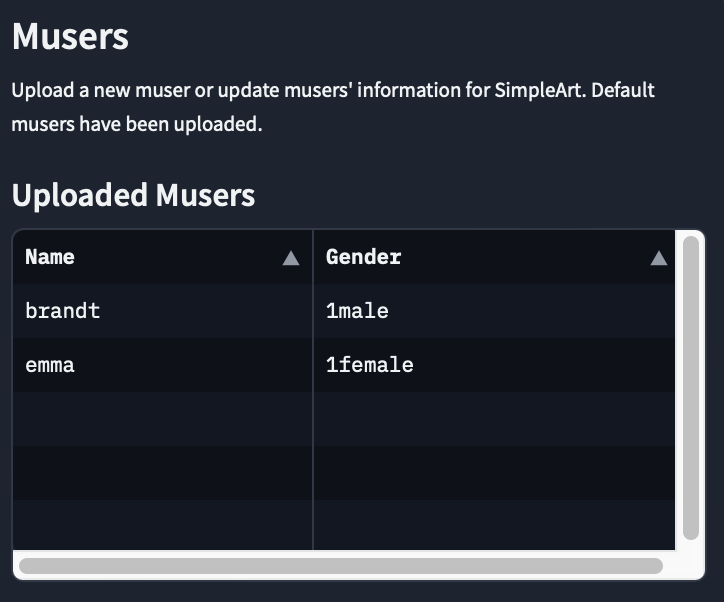
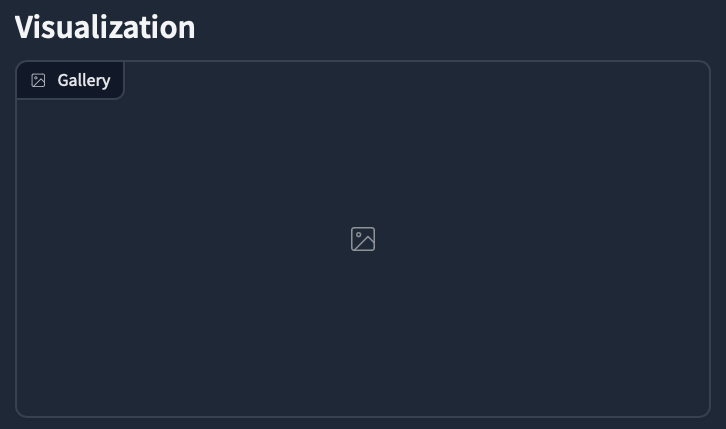
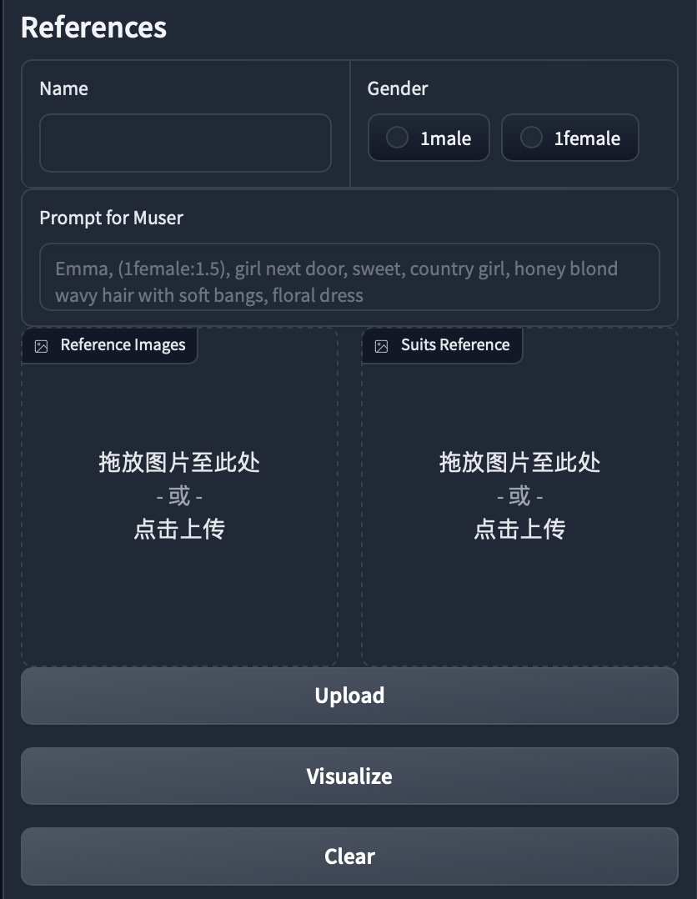
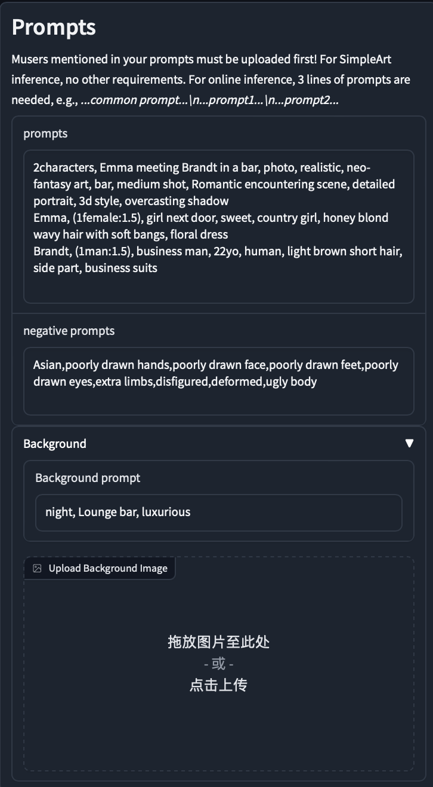
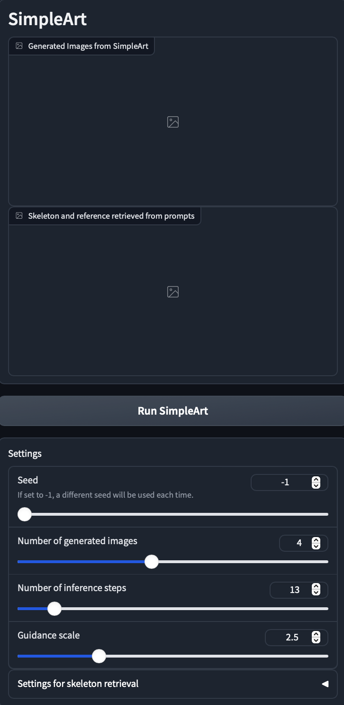

# Gradio界面说明

## Characters

包含所有已经上传的character信息，包括姓名和性别

## Visualization

可视化区域，用于展示根据输入的姓名和性别信息所选定的character的所有参考。

## References

Character参考信息输入界面，包含Character姓名、性别、参考图片和着装参考。

按钮说明：
- **Upload**：上传新的Character或者更新选定Character的参考图片。如果需要上传新的Character，需要完整输入一个不与现有Character冲突的新名字、性别信息、对应prompt（用于线上模型识别角色）以及一张参考图片和一张着装参考（可选）。如果需要更新Character信息，通过名字和性别确认一个已上传的Character，然后按照同样的规则上传参考图片或者着装参考，如果不输入则沿用之前上传的图片。
- **Visualize**：可视化指定Character的所有参考图片。输入Character姓名和对应性别来确定一个已经上传的Character，通过点击Visualize实现在可视化区域展示该Character的参考图片信息。
- **Clear**：删除指定的Character。输入Character姓名和对应性别来确定一个已经上传的Character，点击Clear删除。

## Prompts

Prompts输入界面，包含规定格式的prompt输入、negative prompt以及背景相关prompt。其中，prompt有输入格式相关的要求（具体参考说明文字），尽量参考默认prompt的输入格式，背景prompt和背景参考图片都是可选输入的。

## RaCig

RaCig输出界面，可视化区域包含模型的输出图片和搜索的skeleton参考结果，Settings区域支持模型推理时的参数调整。其中，可以调整的包含随机化种子、生成图片数量、推理步数等设置，具体参考对应说明。

