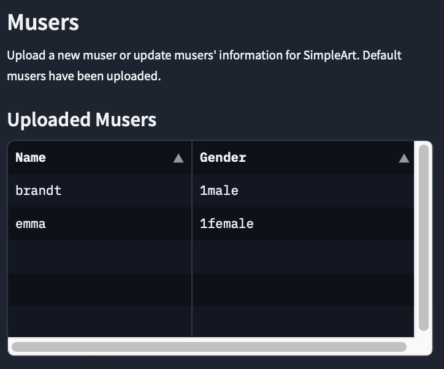
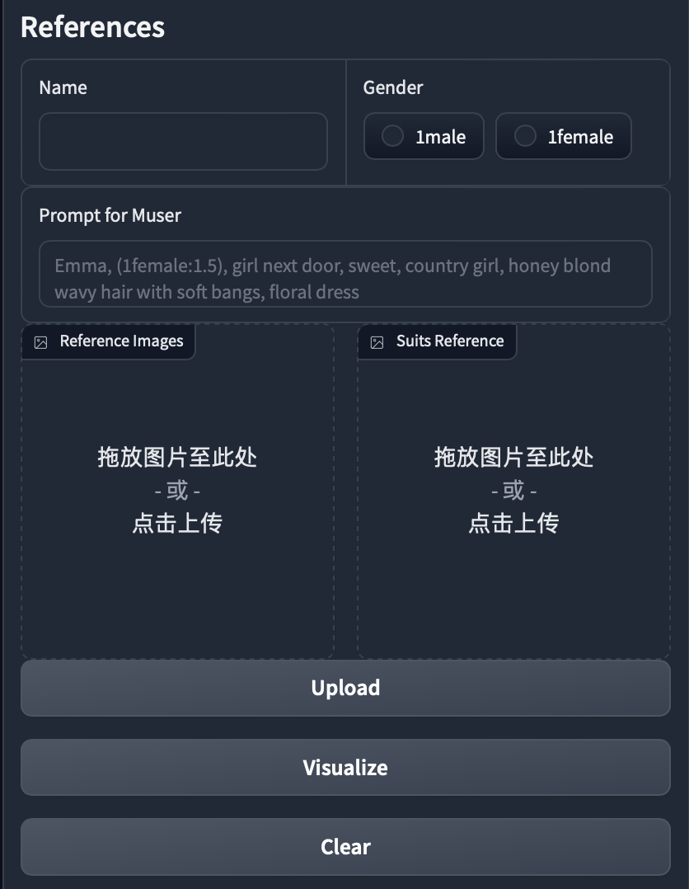

Gradio Interface Instructions

## Characters

Contains information about all uploaded characters, including name and gender.

## Visualization

Visualization area, used to display all references of the selected character based on the input name and gender information.

## References

Character reference information input interface, including Character name, gender, reference image, and clothing reference.
Button descriptions:
*   **Upload**: Upload a new Character or update the reference images for a selected Character. To upload a new Character, you need to enter a new name (that doesn't conflict with existing Characters), gender information, corresponding prompt (for online model recognition), a reference image, and an optional clothing reference. To update Character information, confirm an uploaded Character by name and gender, then upload reference images or clothing references following the same rules. If no input is provided, the previously uploaded images will be used.
*   **Visualize**: Visualize all reference images for a specified Character. Enter the Character's name and corresponding gender to identify an already uploaded Character, then click Visualize to display the Character's reference image information in the visualization area.
*   **Clear**: Delete the specified Character. Enter the Character's name and corresponding gender to identify an already uploaded Character, then click Clear to delete.
  

## Prompts

Prompts input interface, including prompt input in the specified format, negative prompt, and background-related prompts. The prompt has specific format requirements (refer to the description text for details); try to follow the default prompt input format. Background prompts and background reference images are optional inputs.

## RaCig

RaCig output interface. The visualization area includes the model's output images and the searched skeleton reference results. The Settings area supports parameter adjustments during model inference. Adjustable settings include randomization seed, number of generated images, inference steps, etc. Refer to the corresponding descriptions for details.

 